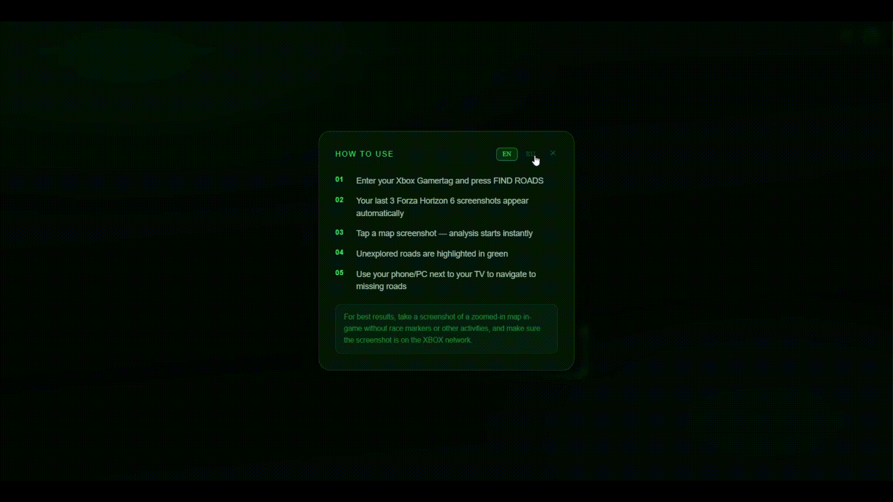
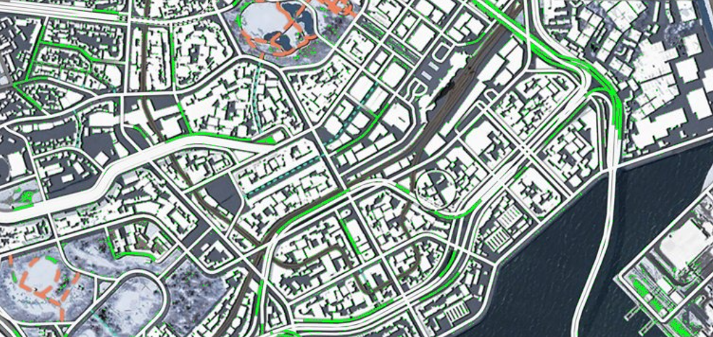

# Forza Horizon 6 Road Finder



> 🏎️ Open-source tool for Forza Horizon 6 Xbox players to find unexplored roads on the map in seconds.

**Link:** https://forza-horizon6-road-finder.vercel.app

---

## The Problem

Getting 100% road exploration in Forza Horizon 6 requires driving every road on the map (671). When you're at 99.8%, those last unexplored roads are tiny grey pixels nearly invisible on a TV screen. PC players have scripts for this — **Xbox players had nothing, until now.**

## How It Works

1. Open the site on your phone while sitting in front of your TV
2. Enter your Xbox Gamertag
3. Your last 3 Forza Horizon 6 screenshots appear automatically (synced from Xbox Live)
4. Tap a map screenshot — analysis runs instantly
5. Every unexplored road lights up in bright green
6. Pick up your controller and drive there

**Total time: ~10-15 seconds**



---

## Architecture

```
Phone (browser)
      │  HTTPS
      ▼
┌─────────────────────┐
│   Next.js 14        │  Vercel
│                     │
│  /api/xbox          │──► OpenXBL API (Xbox Live profile + screenshots)
│  /api/screenshots   │
│  /api/analyze       │──► CV Service (Railway)
│  /api/proxy-image   │
└─────────────────────┘
           │
           ▼
┌─────────────────────┐
│   FastAPI + OpenCV  │  Railway (Docker)
│                     │
│  POST /analyze      │  Weighted Euclidean distance in linear sRGB
│  GET  /health       │  Replaces #808080 grey → bright green
└─────────────────────┘
```

## CV Algorithm

Unexplored roads in Forza Horizon 6 render as exact `#808080` grey. The algorithm:

1. Convert image to linear sRGB (`x²` approximation)
2. Compute weighted Euclidean distance to `#808080` using Rec.601 luma weights `[0.299, 0.587, 0.114]` — same approach as the WebGL fragment shader in comparable tools
3. Replace matching pixels with `#00FF14` (bright green)
4. Return annotated image as base64 JPEG

This gives clean results with tolerance `5/255` on standard FH6 map screenshots.

---

## Tech Stack

| Layer | Technology |
|-------|-----------|
| Frontend | Next.js 14 (App Router), TypeScript, Tailwind CSS |
| CV Service | Python 3.12, FastAPI, OpenCV, NumPy |
| Deployment | Vercel (frontend) + Railway (CV service, Docker) |
| Xbox API | OpenXBL — profile lookup, public screenshots |
| Keep-alive | UptimeRobot pings `/health` every 5 min |

---

## Security

- No user data stored — screenshots processed in memory and immediately discarded
- Shared secret (`INTERNAL_SERVICE_SECRET`) between Next.js and CV service — direct CV access returns 401
- Rate limiting on all API endpoints (in-memory, per IP)
- Magic-byte file validation (not just Content-Type)
- CORS restricted to own domain
- Image proxy whitelist — only `*.xboxlive.com` and `*.xbox.com` CDN domains allowed

---

## Local Development

```bash
# 1. Frontend
cd frontend
npm install
cp .env.example .env.local
# Fill in .env.local (see below)
npm run dev

# 2. CV Service
cd cv-service
python -m venv venv
source venv/bin/activate        # Windows: venv\Scripts\activate
pip install -r requirements.txt
uvicorn main:app --reload --port 8000
```

## Project Structure

```
forza-road-finder/
├── frontend/                    # Next.js app (Vercel)
│   ├── app/
│   │   ├── page.tsx             # UI: home → profile → result
│   │   ├── layout.tsx
│   │   └── api/
│   │       ├── xbox/            # Xbox Live profile lookup
│   │       ├── screenshots/     # Public Xbox screenshots by XUID
│   │       ├── analyze/         # Proxy to CV service
│   │       └── proxy-image/     # Xbox CDN image proxy
│   ├── lib/security.ts          # Rate limiting, validation, CORS
│   └── types/index.ts
├── cv-service/                  # Python FastAPI (Railway)
│   ├── main.py                  # CV pipeline
│   ├── requirements.txt
│   └── Dockerfile
└── docs/
    └── CONTRIBUTING.md
```

## Contributing

PRs welcome! See [CONTRIBUTING.md](./docs/CONTRIBUTING.md).

If you find an unexplored road that isn't highlighted — open an issue with your map screenshot (region + zoom level). Different biomes (snow, city, autumn, beac, etc) may need tolerance tuning.
